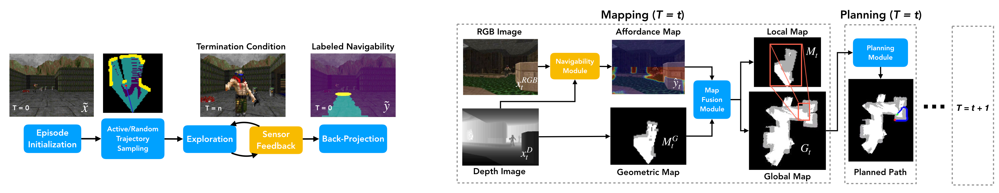

# A2L - Active Affordance Learning

#### Published at ICLR 2020 [[OpenReview]](https://openreview.net/forum?id=BJgMFxrYPB) [[Video]](https://iclr.cc/virtual/poster_BJgMFxrYPB.html) [[PDF]](https://arxiv.org/pdf/2001.02364.pdf)



This repo provides a reference implementation for active affordance learning, which can be employed to improve autonomous navigation performance in hazardous environments (demonstrated here using the VizDoom simulator). The repo also contains a variety of convenient utilities that can be re-used in other VizDoom-based projects to improve quality of life.

## Setup

This code has been tested on Ubuntu 16.04.

### Requirements

1. python >= 3.5
2. keras >= 2.2.0
3. [opencv-python](https://pypi.org/project/opencv-python/) >= 3.4.0

### Installing Dependencies

1. Install [VizDoom](https://github.com/mwydmuch/ViZDoom) simulator into local Python environment.

    ``` bash
    # Install ZDoom dependencies
    sudo apt-get install build-essential zlib1g-dev libsdl2-dev libjpeg-dev \
    nasm tar libbz2-dev libgtk2.0-dev cmake git libfluidsynth-dev libgme-dev \
    libopenal-dev timidity libwildmidi-dev unzip
  
    # Install Boost libraries
    sudo apt-get install libboost-all-dev

    # Install Python 3 dependencies
    sudo apt-get install python3-dev python3-pip
    pip3 install numpy
    ```

2. Install Keras-based [segmentation-models](https://github.com/qubvel/segmentation_models) library.

    ``` bash
    pip3 install segmentation-models
    ```

### Downloading Demo Data

In order to download the demo data (which contains train/test maps, pre-computed train beacons, and a pre-trained A2L model), follow the steps below:

1. Download the demo data into the root of the repo and uncompress using the following commands:

    ``` bash
    wget https://www.dropbox.com/s/0hn71njit81xiy7/demo_data.tar.gz
    tar -xvzf demo_data.tar.gz
    ```

2. Check that the directory structure looks like the following:

    ```bash
    ├── data
    │   ├── beacons
    │   ├── configs
    │   ├── experiments
    │   ├── maps
    │   ├── samples
    │   └── models
    ```

## Usage

Each executable script included in this repo is prefixed with *run* in its file name. For a detailed description of all possible configuration arguments, please run with the ```-h``` flag.

### Generating Partially-Labeled Self-Supervised Samples

The following sequence of commands are used to generate a configurable number of partially-labeled examples of navigability in a self-supervised manner. This should work with any set of  maps that are compatible with VizDoom.

1. Generate a set of beacons for each map - which describe valid spawn points from which the agent can start a sampling episode.

    ``` bash
    python preprocess/run_beacon_generation.py --wad-dir ../data/maps/train/ --save-dir ../data/beacons/train/
    ```
  
2. Generate a configurable number of self-supervised examples per map.

    ``` bash
    python train/run_data_sampling.py --wad-dir ../data/maps/train/ --beacon-dir ../data/beacons/train/ --save-dir ../data/samples/train/ --samples-per-map 500
    ```

### Training Affordance Segmentation Models

The following command is used to train a ResNet-18-based UNet segmentation model to predict pixel-wise navigability.

1. Train UNet-based segmentation model.

    ``` bash
    python train/run_train_model.py --data-dir ../data/samples/train/ --save-dir ../data/models/ --epochs 50 --batch-size 40
    ```

### Training Segmentation Models with Active Affordance Learning

The following command is used to train a ResNet-18-based UNet segmentation model using active affordance learning. The script alternates between data generation and model training, using trained seed models to actively seek out difficult examples.

1. Train UNet-based segmentation model using active affordance learning.

    ``` bash
    python train/run_train_A2L.py --wad-dir ../data/maps/train --beacon-dir ../data/beacons/train --save-dir ../data/models/active --active-iterations 5 --samples-per-map 500 --epochs 50 --batch-size 40
    ```

### Evaluating Navigation Performance

The following command is used to evaluate the performance of an affordance-based agent in a goal-directed navigation task. It can also be used to evaluate a geometry-based agent by dropping the ```--model-path``` argument.

1. Run navigation experiments specified using JSON file.
    ``` bash
    python eval/run_eval_navigation.py --wad-dir ../data/maps/test --model-path ../data/models/seg_model.h5 --experiment-path ../data/experiments/navigation/demo.json --iterations 5
    ```

## Citing

If you've found this code to be useful, please consider citing our paper!

``` latex
@inproceedings{qi2020learning,
  title={Learning to Move with Affordance Maps},
  author={Qi, William and Mullapudi, Ravi Teja and Gupta, Saurabh and Ramanan, Deva},
  booktitle={International Conference on Learning Representations (ICLR)},
  year={2020}
}
```

## Questions

If you have additional questions/concerns, please feel free to reach out to wq@cs.cmu.edu.
